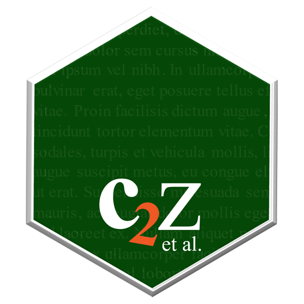

<!-- README.md is generated from README.Rmd. Please edit that file -->

# *c2z4uni*: a Reference Manager in *R* for universities

 

 

# 

## What is *c2z4uni* (Cristin to Zotero)?

*c2z4uni* is an extension for the [*R*](https://www.r-project.org/)
package [*c2z*](https://oeysan.github.io/c2z/). The purpose of the
package is to create a [Zotero](https://www.zotero.org/) library for
your university, department, or research group. Use with the
[Hugo](https://gohugo.io/) theme
[hugo-library](https://github.com/oeysan/hugo-library) to create an
online reference library, and/or a *R* package (e.g.,
[emayili](https://cran.r-project.org/package=emayili)) to create email
newsletters.

See [c2z4inn](https://oeysan.github.io/c2z4inn/) for a living example of
the project.

## Limitations

Please report any bugs/issues/requests
[here](https://github.com/oeysan/c2z4uni/issues/), and feel free to make
a [pull request](https://github.com/oeysan/c2z4uni/pulls).

## Code of conduct

Don’t be evil. Please read the [Code of
Conduct](https://oeysan.github.io/c2z4uni/CONDUCT.html)

## License

This project is licensed under the MIT License - see
[LICENSE](https://oeysan.github.io/c2z4uni/LICENSE.html) for details

## Acknowledgments

Henrik Karlstrøm for his work on
[rcristin](https://github.com/henrikkarlstrom/rcristin)
